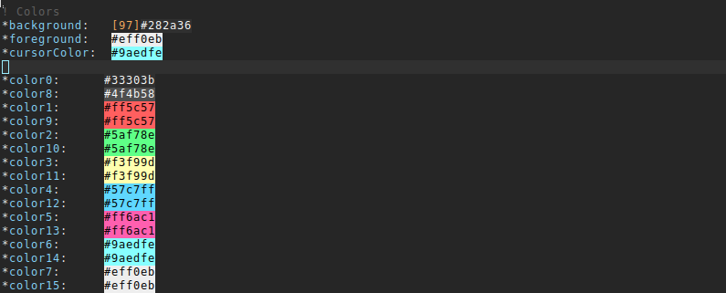
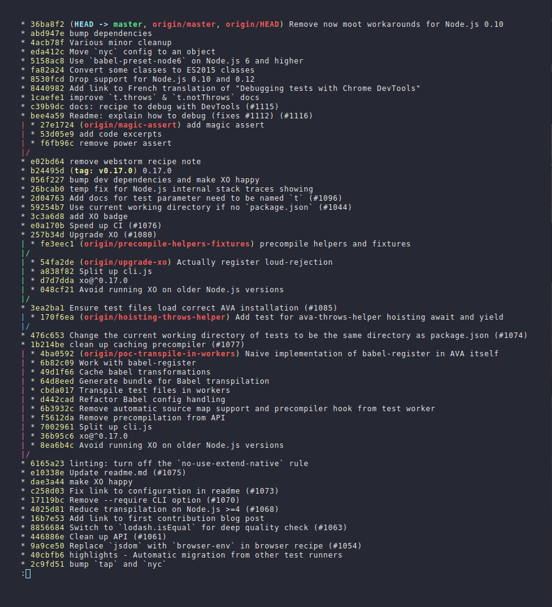

# urxvt-snazzy

> Elegant [Rxvt-unicode](https://en.wikipedia.org/wiki/Rxvt-unicode) theme with bright colors




## Install

- Add these colour settings to your `.Xresources` file:
```
*background:   [97]#282a36
*foreground:   #eff0eb
*cursorColor:  #9aedfe

*color0:      #33303b
*color8:      #4f4b58
*color1:      #ff5c57
*color9:      #ff5c57
*color2:      #5af78e
*color10:     #5af78e
*color3:      #f3f99d
*color11:     #f3f99d
*color4:      #57c7ff
*color12:     #57c7ff
*color5:      #ff6ac1
*color13:     #ff6ac1
*color6:      #9aedfe
*color14:     #9aedfe
*color7:      #eff0eb
*color15:     #eff0eb
```
- Alternatively, you can copy the `.Xresources` file directly from this repo which also sets the right font. (You will need to have the Menlo font installed)

## Tip

To get the exact same look as in the screenshot, you need to use the [Pure](https://github.com/sindresorhus/pure) prompt, Menlo font, and the [zsh-syntax-highlighting](https://github.com/zsh-users/zsh-syntax-highlighting) plugin to have commands highlighted.


## Related

- [hyper-snazzy](https://github.com/sindresorhus/hyper-snazzy) - Hyper version
- [iterm2-snazzy](https://github.com/sindresorhus/iterm2-snazzy) - iTerm2 version
- [terminal-snazzy](https://github.com/sindresorhus/terminal-snazzy) - Terminal version


## License

MIT © [Leon Grasmeijer](mailto:leongrasmeijer@gmail.com)
